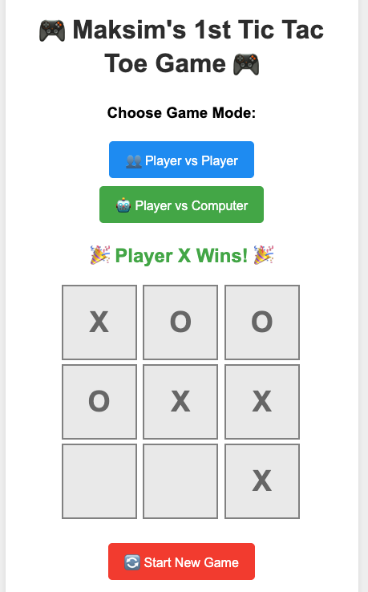
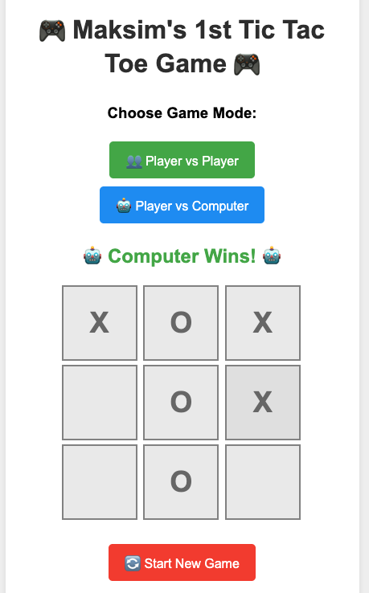

# 🎮 Maksim's First Tic Tac Toe Game

My very first programming project! A fun and simple Tic Tac Toe game that runs in any web browser.

## 🌟 Features

- **Single HTML file** - Everything in one easy file!
- **Two game modes:**
  - 👥 **Player vs Player** - Play with a friend
  - 🤖 **Player vs Computer** - Challenge the AI
- **Smart computer** - The AI tries to win and block you
- **Colorful design** - Fun and easy to use
- **Works everywhere** - Runs in any web browser
- **Ready to deploy** - Just upload to any web server

## 🎯 How to Play

1. Open `tic-tac-toe.html` in your web browser
2. Choose your game mode (Player vs Player or Player vs Computer)
3. Click on empty squares to place your X or O
4. Try to get 3 in a row (horizontal, vertical, or diagonal)
5. Click "🔄 Start New Game" to play again

## 🚀 How to Deploy

1. Upload `tic-tac-toe.html` to your web server
2. Share the link with friends
3. Play anywhere, anytime!

## 🛠️ What I Learned

This project taught me:
- HTML structure
- CSS styling
- JavaScript programming
- Game logic
- Basic AI programming

## 📸 Screenshots

## 🎉 About This Project

This is my first programming project as an 11-year-old learning to code! The game is built with simple HTML, CSS, and JavaScript - perfect for beginners.
